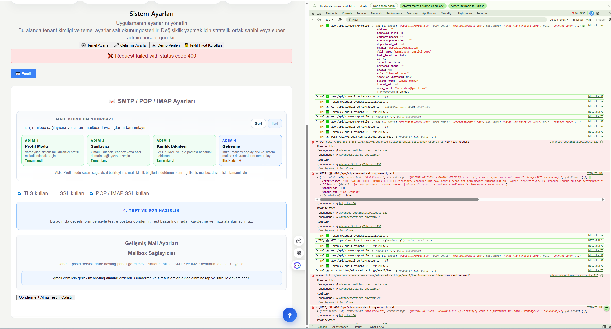

# Is Ortagi Network Workflow (V1)

Bu dosya, is ortagi profil donusumu ve network komisyon sisteminin tek kaynak
is akisi dosyasidir.

Ana plan referansi: TENANT_SAAS_TRANSFORMATION_PLAN.md > Bolum 9

## 0) Durum Panosu (Milestone-0)

- [x] Ihtiyac analizi ve hedef urun resmi netlesti
- [x] Workflow dosyasi olusturuldu
- [x] Profil ekrani v2 bilgi mimarisi
- [x] Is ortagi paneli personel gorunurlugu bugfix
- [x] Ekip hiyerarsisi (Channel Account Owner kok)
- [x] Profil/Personel duzenleme ekrani teklestirme
- [x] Onay limiti kaldirma + komisyon metriklerine gecis
- [x] Referral/link altyapisi
- [x] Komisyon motoru v1
- [x] Komisyon motoru v1 DB migration taslagi
- [x] Kampanya ve sosyal baglanti v1

## 1) Kapsam ve Urun Hedefi

Hedef, is ortagi panelini basit profil ekranindan cikarip su yeteneklere
sahip bir partner growth paneline donusturmektir:

1. Profil + ekip yonetimi
2. Referral/link bazli musteri kazanimi
3. Cok seviyeli komisyon hesaplama
4. Kampanya tanimlama ve yayinlama
5. Performans skorlamasi ve gamification

## 2) Profil Tipleri ve Hiyerarsi

### 2.1 Profil Tablosu

| Profil Tipi | Sahiplik | Ekip Kurma | Komisyon | Kampanya | Not |
| -- | --- | --- | --- | --- | --- |
| Bireysel Is Ortagi | Kisi | Evet | Evet | Evet | Firma olmadan calisabilir |
| Kurumsal Is Ortagi | Firma | Evet | Evet | Evet | Firma altinda ekip kurar |
| Ekip Uyesi|Owner altinda|Rol bazli|Evet|Rol bazli Yonetici,lider,temsilci vb.|
| Channel Account Owner|Kok hesap|Tam|Evet + lider payi|Tam|Hiyerarsinin tepesi|

### 2.2 Ekip Hiyerarsisi Kurali

- Ekip agaci tek kokten baslar: Channel Account Owner.
- Kanal Yoneticisi, Kanal Denetcisi, Kanal Lideri, Kanal Finans Izleyicisi,
  Kanal Temsilcisi bu owner altinda roller olarak gorunur.
- Liste yerine agac (tree) ve grup karti kullanilir.

## 3) Ekran Bazli Detayli Kullanici Akislari

### 3.1 Is Ortagi > Profilim (Yeni)

1. Kullanici Profilim'e girer.
2. Ustte Partner Ozet Karti gorur:
   - Seviye, yildiz, toplam komisyon, bu ay net kazanc
   - Toplam ekip, aktif ekip, son 30 gun yeni musteri
3. Link Merkezi:
   - Ana davet linki
   - Kampanya linkleri
   - Kisa link + QR kopyalama
4. Komisyon Panosu:
   - Bekleyen, onaylanan, odenen
   - Yuzde ve net tutar
5. Ag ve Donusum:
   - Getirilen stratejik ortak
   - Getirilen tedarikci
   - Donusen hesaplar (tedarikci->stratejik vb.)
6. Aksiyonlar:
   - Kampanya olustur
   - Sosyal medya paylas
   - Ekip uyesi davet et

### 3.2 Is Ortagi > Personeller

1. Kanal ekibi tek owner karti altinda acilir.
2. Sekmeler:
   - Tum ekip
   - Aktif/Pasif
   - Rol bazli filtre
3. Her ekip karti:
   - Rol
   - Getirdigi musteri sayisi
   - Son 30 gun puan
   - Komisyon katkisi
4. Detay tiklandiginda super admin ile ayni edit formu acilir.

### 3.3 Super Admin > Personel Detay / Duzenle

1. Form yapisi is ortagi paneliyle ayni olur.
2. Onay limiti alani kaldirilir.
3. Yeni alanlar:
   - Referral kodu
   - Komisyon plani
   - Ust ekip lideri
   - Sosyal baglantilar

### 3.4 API Alan Sozlesmesi (V1)

Profilim sayfasi icin hedef response (ornek):

- GET /api/v1/channel/profile/summary
  - owner_user_id
  - partner_type
  - display_name
  - level_code
  - star_score
  - performance_score
  - total_team_size
  - active_team_size
  - last_30d_new_customers
  - commission_pending
  - commission_approved
  - commission_paid
  - commission_net_current_month

- GET /api/v1/channel/profile/referral-links
  - link_id
  - link_code
  - short_url
  - qr_url
  - campaign_id
  - target_type
  - is_active

- GET /api/v1/channel/profile/conversion-metrics?period=30d
  - clicks
  - signups
  - activations
  - converted_partner_count
  - converted_supplier_count
  - supplier_to_partner_count

Personeller (is ortagi paneli) icin hedef response:

- GET /api/v1/channel/team
  - owner_user_id
  - root_node
  - nodes[]
    - user_id
    - full_name
    - email
    - role_profile_code
    - parent_user_id
    - depth
    - is_active
    - customer_count
    - score_30d
    - commission_contribution_30d

Detay/editor ortak endpointleri:

- GET /api/v1/channel/team/{user_id}
- PATCH /api/v1/channel/team/{user_id}
  - full_name
  - work_email
  - role_profile_code
  - social_links
  - commission_plan_code

## 4) Veri Tutarliligi Bugfix Paketi

Sorun: Is ortagi panelinde personel 0 gorunurken super adminde personel var.

Cozum paketi:

- [x] Backend endpointte tenant/scope/owner filtreleri hizalanir.
- [x] Is ortagi paneli, super admin ile ayni canonical personel kaynagini kullanir.
- [x] Aktif/pasif filtre semantigi iki panelde birebir aynilanir.
- [x] Hedefli testler: owner=68 gibi rol ve scope bazli snapshot testleri.
- [x] Frontend segment secim bugfixi (channel persona -> channel segment)
- [x] Frontend live filter wiring: PersonnelTab segment degisince
  reloadPersonnel({ scope }) cagirilir

2026-04-23 uygulanan duzeltme:

- PersonnelTab segment seciminde channel personasi icin yanlislik vardi.
   Non-super channel kullanicilari partner segmentine dusuyordu.
   Bu bugfix ile channel personasi dogrudan `channel` segmentini gorur.
   Dosya: web/src/pages/admin/PersonnelTab.tsx

- Admin users endpointine scope/status_filter/owner_user_id filtreleri eklendi,
   channel rolleri icin workspace query kisiti ekip odakli hale getirildi.
   Dosya: api/routers/admin.py

- Owner ve scope davranisini kilitleyen backend snapshot testleri eklendi.
   Dosya: tests/test_org_catalog_workspace_authz.py

- AdminPage'e reloadPersonnel useCallback eklendi; PersonnelTab segment degisince
   useEffect ile getTenantUsers({ scope }) cagrisi tetiklenir.
   2 yeni frontend testi eklendi (8/8 passing).
   Dosyalar: web/src/pages/AdminPage.tsx, web/src/pages/admin/PersonnelTab.tsx,
             web/src/test/personnel-tab-permissions.test.tsx

Basari kriteri:

- Ayni owner ve ayni filtrede iki panelin satir sayisi ve
  kayit kimlikleri birebir ayni.

## 5) Veritabani Sema Taslagi (V1)

Not: Isimlendirme mevcut domainle uyumlu tutulur; gerekiyorsa tenant/channel
alanlariyla normalize edilir.

### 5.1 Yeni/Genisletilecek Tablolar

1. channel_partner_profiles

- id
- owner_user_id
- partner_type (individual/company)
- company_id (nullable)
- display_name
- level_code
- star_score
- performance_score
- status
- created_at, updated_at

1. channel_partner_team_nodes

- id
- owner_user_id
- user_id
- parent_node_id (nullable)
- role_profile_code
- depth
- is_active
- created_at, updated_at

1. referral_links

- id
- owner_user_id
- created_by_user_id
- link_code (unique)
- campaign_id (nullable)
- target_type (partner/supplier/mixed)
- landing_path
- is_active
- created_at, updated_at

1. referral_events

- id
- referral_link_id
- event_type (click/signup/activation/order)
- actor_user_id (nullable)
- actor_company_id (nullable)
- source_scope
- target_scope
- amount_base (nullable)
- event_at

1. commission_plans

- id
- plan_code
- is_active
- config_json
- created_at, updated_at

1. commission_ledger

- id
- owner_user_id
- beneficiary_user_id
- referral_event_id
- level_index
- role_multiplier
- commission_rate
- gross_amount
- net_amount
- status (pending/approved/paid/reversed)
- period_key
- created_at, updated_at

1. campaign_rules

- id
- owner_user_id (nullable for platform campaign)
- campaign_name
- start_at, end_at
- bonus_type (rate/fixed)
- bonus_value
- eligibility_json
- is_active
- created_at, updated_at

1. social_connections

- id
- owner_user_id
- provider (instagram/x/linkedin/facebook/youtube/tiktok)
- account_handle
- access_status
- created_at, updated_at

### 5.2 Index ve Performans

- referral_links(link_code) unique index
- referral_events(referral_link_id, event_at)
- commission_ledger(owner_user_id, period_key, status)
- channel_partner_team_nodes(owner_user_id, parent_node_id)

### 5.3 Migration Taslagi Referansi

- migrations/2026_04_23_add_channel_network_commission_v1_draft.sql
- Durum: Taslak olusturuldu, canliya alinmadi
- Not: Mevcut `commission_ledger` tablosuyla cakismamak icin V1 tablolari
   `channel_` on eki ile ayri tutuldu.

## 6) Komisyon Kurallari - V1 Matematik Modeli

Amac:

- Performans artinca oran kademeli artsin.
- Performans dusunce oran bir anda cok sert dusmesin.

### 6.1 Ana Bilesenler

- base_rate: plana bagli taban oran (ornek %4)
- level_bonus: seviye bonusu (L1, L2, L3)
- role_multiplier: rol katsayisi (lider > temsilci)
- performance_factor: son 90 gun performans katsayisi
- campaign_bonus: aktif kampanya bonusu

Ornek hesap:

commission_rate = base_rate
                + level_bonus
                + campaign_bonus

`commission_gross = amount_base * commission_rate * role_multiplier * performance_factor`

commission_net = commission_gross - kesintiler

### 6.2 Performansa Gore Kademeli Artis

Ornek esikler (degistirilebilir):

- 0-9 musteri: +0.0 puan
- 10-24 musteri: +0.4 puan
- 25-49 musteri: +0.8 puan
- 50+ musteri: +1.2 puan

Not: Esik gecisi bir sonraki donemde aktif olur (ani sicrama kontrolu).

### 6.3 Yumusak Dusus (Motivasyon Koruma)

Sert dusus yerine iki tampon kullanilir:

1. Grace period: performans dususunden sonra 2 donem oran korunur.
2. Max drop cap: tek donemde oran dususu en fazla 0.3 puan olur.

Ornek:

- Gecen donem oran: %6.2
- Bu donem ham hesap: %5.4
- Uygulanan oran (cap): %5.9 (tek adimda en fazla -0.3)

### 6.4 Lider ve Alt Rol Ayrimi

- Team lead multiplier: 1.15
- Agent multiplier: 1.00
- Finance viewer: 0.00 (gosterim rolu)
- Auditor: 0.00 (gosterim rolu)

Not: Denetim/izleme rolleri komisyon almaz, sadece gorur.

## 7) Kampanya Motoru V1

### 7.1 Platform Kampanyasi (Admin)

- Ornek: "90 gunde 20 stratejik ortak getirene +%8 bonus"
- Sureli ve hedefli
- Tekil referral link veya tum owner havuzu icin uygulanabilir

### 7.2 Is Ortagi Kampanyasi (Owner)

- Owner kendi ekibi icin mini kampanya acabilir
- Yetkiye gore bonus tavanlari sinirlanir
- Sosyal baglantilara tek tikla yayinlanir

## 8) UI Bilesen Listesi (V1)

- [x] PartnerSummaryCard
- [x] CommissionOverviewPanel
- [x] ReferralLinkCenter
- [x] TeamHierarchyTree
- [x] TeamPerformanceTable
- [x] ConversionFunnelPanel
- [x] ConversionOverviewPanel
- [x] ChannelPrimitives UI kit
- [x] CampaignManagerPanel
- [x] SocialConnectionPanel
- [x] UnifiedPersonnelEditModal (super admin + is ortagi ortak)

## 9) Sprint Tabanli Is Plani

### Sprint-1 (Temel)

- [x] Veri tutarliligi bugfix (personel gorunurlugu)
- [x] UnifiedPersonnelEditModal
- [x] Profilim v2 temel kartlar

Not (2026-04-23): /api/v1/channel/profile/summary endpointi eklendi.
ProfilePage icinde channel scope icin Is Ortagi Ozet Karti (ekip, donusum,
komisyon metrikleri) yayina alindi.

### Sprint-2 (Referral + Komisyon V1)

- [x] referral_links + referral_events
- [x] commission_ledger + hesaplama servisi
- [x] komisyon paneli ve period raporu

Not (2026-04-23): Baslangic referral altyapisi devreye alindi.
Backend: /api/v1/channel/profile/referral-links,
/api/v1/channel/profile/referral-events,
/api/v1/channel/profile/conversion-metrics endpointleri eklendi.
Frontend: ProfilePage icinde Link Merkezi ve Ag ve Donusum kartlari baglandi.

Not (2026-04-23 / devam): Komisyon V1 adimi devreye alindi.
Backend: /api/v1/channel/profile/commission-recalculate ve
/api/v1/channel/profile/commission-report endpointleri eklendi; referral
eventlerinden commission_ledger kaydi ureten hesaplama servisi baglandi.
Frontend: ProfilePage icinde "Komisyon Period Raporu" bolumu ve manuel
"Komisyonu Senkronize Et" aksiyonu eklendi.

### Sprint-3 (Hiyerarsi + Kampanya)

- [x] TeamHierarchyTree
- [x] campaign_rules ve kampanya paneli
- [x] sosyal baglanti paneli

Not (2026-04-23 / Sprint-3 madde 1): TeamHierarchyTree devreye alindi.
Backend: GET /api/v1/channel/profile/team-hierarchy endpointi eklendi;
ChannelOrganization uyelerini role_profile_code derinligine gore agac olarak
dondurur (account_owner=0, team_lead=1, agent=2, junior_agent=3).
Frontend: web/src/components/channel/TeamHierarchyTree.tsx bileseni olusturuldu;
collapse/expand destekli DFS agac render. ProfilePage'de "Ekip Hiyerarsisi"
bolumuyle entegre edildi. Testler: 2/2 passed.

Not (2026-04-23 / Sprint-3 madde 2): Kampanya paneli v1 devreye alindi.
Backend: GET /api/v1/channel/profile/campaigns endpointi eklendi.
Channel audience ve public kampanyalar, campaign_rules ile birlikte doner;
kullanici/org bazli progress ve kazanilan oduller de response'a eklenir.
Frontend: web/src/components/channel/CampaignPanel.tsx olusturuldu;
ProfilePage icinde "Kampanya Paneli" bolumu baglandi. Testler: 2/2 passed.

Not (2026-04-23 / Sprint-3 madde 3): Sosyal baglanti paneli v1 devreye alindi.
Backend: GET /api/v1/channel/profile/social-links endpointi eklendi;
aktif referral linkten WhatsApp, LinkedIn, X, Facebook, Telegram ve E-posta
icin paylasim URL'leri uretilir. Frontend:
web/src/components/channel/SocialSharePanel.tsx olusturuldu; ProfilePage icinde
"Sosyal Baglanti Paneli" bolumuyle entegre edildi. Testler: 2/2 passed.

### Sprint-4 (Performans Derinlestirme)

- [x] TeamPerformanceTable (ilk surum)
- [x] ConversionFunnelPanel (ilk surum)
- [x] PartnerSummaryCard + CommissionOverviewPanel componentizasyonu
- [x] ReferralLinkCenter componentizasyonu
- [x] ConversionOverviewPanel componentizasyonu
- [x] ChannelPrimitives UI kit (SectionCard/Header/StatCard)
- [x] Team/Kampanya panel standardizasyonu (SectionCard/Header)
- [x] Component-level test split (channel)

Not (2026-04-23 / Sprint-4 madde 1): TeamPerformanceTable devreye alindi.
Backend: GET /api/v1/channel/profile/team-performance endpointi eklendi;
uye bazli referral sayisi, son 30 gun aktivitesi, event bazli komisyon toplami
ve performans skoru doner. Frontend:
web/src/components/channel/TeamPerformanceTable.tsx olusturuldu; ProfilePage
icinde "Ekip Performans Tablosu" bolumuyle entegre edildi. Testler: 2/2 passed.

Not (2026-04-23 / Sprint-4 madde 2): ConversionFunnelPanel devreye alindi.
Backend: GET /api/v1/channel/profile/conversion-metrics endpointi funnel
oranlari (click->signup, signup->activation, activation->partner) ve gunluk
trend listesi dondurecek sekilde genisletildi. Frontend:
web/src/components/channel/ConversionFunnelPanel.tsx olusturuldu; ProfilePage
icinde Ag ve Donusum bolumune entegre edildi. Testler: 2/2 passed.

Not (2026-04-23 / Sprint-4 madde 3): PartnerSummaryCard ve
CommissionOverviewPanel componentizasyonu tamamlandi.
Frontend: web/src/components/channel/PartnerSummaryCard.tsx ve
web/src/components/channel/CommissionOverviewPanel.tsx olusturuldu;
ProfilePage icindeki inline ozet/komisyon bloklari bu componentlere tasindi.
Testler: 2/2 passed.

Not (2026-04-23 / Sprint-4 madde 4): ReferralLinkCenter componentizasyonu
tamamlandi.
Frontend: web/src/components/channel/ReferralLinkCenter.tsx olusturuldu;
ProfilePage icindeki inline Link Merkezi blogu bu componente tasindi.
Link bazli kopyalama aksiyonu eklendi. Testler: 2/2 passed.

Not (2026-04-23 / Sprint-4 madde 5): ConversionOverviewPanel
componentizasyonu tamamlandi.
Frontend: web/src/components/channel/ConversionOverviewPanel.tsx olusturuldu;
ProfilePage icindeki inline Ag ve Donusum blogu bu componente tasindi.
Conversion metrik kartlari, funnel paneli ve komisyon raporu tek yapida
birlestirildi. Testler: 2/2 passed.

Not (2026-04-23 / Sprint-4 madde 6): ChannelPrimitives UI kit devreye alindi.
Frontend: web/src/components/channel/ChannelPrimitives.tsx olusturuldu
(SectionCard, SectionHeader, StatCard). PartnerSummaryCard,
ReferralLinkCenter ve ConversionOverviewPanel bu primitive'lere gecirildi;
stil tekrari azaltildi. Testler: 2/2 passed.

Not (2026-04-23 / Sprint-4 madde 7): TeamHierarchy, TeamPerformance ve
Kampanya panel kapsamlari SectionCard/SectionHeader primitive'lerine
standartlastirildi.
Frontend: ProfilePage icindeki bu paneller ortak frame/header yapisina
tasindi; gorunum tutarliligi artirildi. Testler: 2/2 passed.

Not (2026-04-23 / Sprint-4 madde 8): Channel component-level test split
tamamlandi.
Frontend test: web/src/test/channel-components.test.tsx dosyasi eklendi.
PartnerSummaryCard, ReferralLinkCenter ve ConversionOverviewPanel icin
ayri component-level coverage olusturuldu. Testler: 5/5 passed
(2 test dosyasi).

Not (2026-04-23 / Sprint-4 madde 8.1): Channel test mock verileri
merkezilestirildi.
Frontend test: web/src/test/channel-test-data.ts dosyasi ile ortak fixture
kaynagi olusturuldu; profile-page-channel-summary ve channel-components
testleri tekrar eden mock bloklari yerine bu kaynagi kullanacak sekilde
refactor edildi. Testler: 5/5 passed.

### Sprint-5 (Performans + Onay + Dashboard + Landing)

- [x] Performans Skorlama + Gamification (L1/L2/L3, rozet, performans faktoru)
   > **Not:** `GET /channel/profile/gamification` endpoint eklendi.
   `LEVEL_THRESHOLDS` + `BADGE_DEFINITIONS` ile L0-L3 seviyeleri, yildiz skoru
   ve performans faktoru hesaplaniyor. Frontend: `GamificationPanel.tsx` —
   ProfilePage'e entegre edildi.
- [x] Admin Komisyon Onay Akisi (tekil + toplu onay, paid durumu)
   > **Not:** `GET /admin/channel/commission-ledger`,
   `POST /admin/channel/commission-ledger/{id}/approve`,
   `POST /admin/channel/commission-ledger/bulk-approve`
   endpoint'leri eklendi. Frontend: `CommissionApprovalPanel.tsx` +
   `CommissionAdminTab.tsx` — AdminPage'e lazy tab olarak eklendi.
- [x] Komisyon Dashboard (tenant/admin ozet: bekleyen, onaylanan, odenen)
   > **Not:** `GET /admin/channel/commission-dashboard` endpoint'i eklendi;
   toplam tutarlar + org breakdown donuyor. Frontend:
   `CommissionDashboardPanel.tsx` — CommissionAdminTab icerisinde gosteriliyor.
- [x] Public Referral Landing Page (/r/{code} — kayit CTA, tiklama takibi)
   > **Not:** `GET /channel/public/r/{link_code}` endpoint'i eklendi
   (auth gerektirmiyor), tiklama olayi atomik kaydediliyor. Frontend:
   `ReferralLandingPage.tsx` — `/r/:code` rotasina baglandı,
   target_type'a gore supplier/is-ortagi kayit CTA'si gosteriyor. Testler: 7/7 passed.

### Sprint-6 (Kanal E-posta Ayarlari Derinlesmesi)

- [x] Kanal hesap sahibi icin settings panelini e-posta odakli sadeleştirme
- `SettingsTab` channel scope icin tek sekme moduna alindi.
- Temel Ayarlar, Demo Verileri ve Teklif Fiyat Kurallari channel panelinden kaldirildi.
- [x] API Anahtarlari sekmesini channel scope icin kapatma
- `AdvancedSettingsTab` icinde API key sekmesi role bazli gizlendi.
- [x] E-posta ayarlari yazma yetkisini channel scope icin acma
- Channel owner artik SMTP/profile/mailbox ayarlarini kaydedebilir.
- [x] 403 gürültüsünü bitirme
- Channel scope icin logging/backup/notification/api-key endpointleri preload edilmez.
- [x] E-posta saglik paneli (7 gun)
- Backend: `GET /api/v1/advanced-settings/email/health`
- Frontend: success/bounce/spam/outbound metrik kartlari.
- [x] Kanal e-posta otomasyon tercihleri (7 baslik)
   1. Sablon yonetimi
   2. Imza kutuphanesi
   3. Saatlik limit + gunluk kota
   4. Saglik paneli
   5. Domain whitelist
   6. Fallback politikasi
   7. Markalama ayarlari
- [x] Domain whitelist zorlamasi
- Kaydetme oncesi `from_email` domaini izinli listede degilse kayit bloklanir.

Teknik saklama modeli:

- Kanal tercihlerinin ilk surumu frontend localStorage ile user-scoped tutulur:
   `channel-email-preferences-v1:{userId}`
- Operasyonel saglik metrikleri backend kaynagindan cekilir (`system_email_messages`).

### Sprint-7 (Admin Destek Talep Yonetim Paneli)

- [x] Destek talebi admin sekme bileseni olusturuldu
- `web/src/components/admin/SupportTicketAdminTab.tsx` eklendi.
- Durum / kategori / oncelik filtresi, ozet metrik kartlari (acik, islemde,
   acil, SLA asimi, toplam).
- Satir bazli genisletme: inline guncelleme formu ile durum, oncelik,
atama ve cozum notu.
- SLA asimi gorsel uyarisi (kirmizi border + SLA etiketi).
- [x] AdminPage.tsx entegrasyonu
- `SupportTicketAdminTab` `commission_admin` sekmesinin hemen ardina eklendi.
- `adminPageMeta.tsx` icine `support_tickets` TabKey ve `DST` / LifeBuoy ikonu eklendi.
- [x] Test coverage: 7/7 test yesil
- `web/src/test/support-ticket-admin.test.tsx` dosyasi eklendi.
- Hedefli suite 66/66 test geciyor.

Not (2026-05-02 / Sprint-7):
Backend: `POST /api/v1/support/tickets`, `GET /api/v1/support/tickets`,
`GET /api/v1/admin/support/tickets`, `PATCH /api/v1/admin/support/tickets/{id}`
endpointleri onceki oturumda olusturulmus ve `main.py`'de kayitliydi.
Frontend hizmet islevleri `adminListSupportTickets` ve `adminUpdateSupportTicket`
`admin.service.ts`'de mevcuttu.
Tenant kullanici tarafi `HelpCenter.tsx` + `SupportTicketWidget.tsx` bilesenlerinde
Sprint-7 oncesinde tamamlanmisti.
Bu sprint yalnizca admin tarafini tamamladi.

### Sprint-8 (Is Ortagi Dashboard ve Ust Menu Sadelestirme)

- [x] Is ortagi ust menuden `Teklifler` sekmesini kaldirma
- `web/src/config/navigation.ts` icinde channel rolleri icin `Teklifler` gizlendi.
- Gerekce: Is ortagi paneli teklif acma/listeleme yerine partner yonlendirme,
ekip ve komisyon takibi odaklidir.
- [x] Is ortagi ust menuden `Profil` sekmesini kaldirma
- `Profil` menusu kaldirildi; profil erisimi sag ustteki
`Profilim` butonundan devam eder.
- [x] Is ortagina ozel dashboard akisi
- `web/src/pages/DashboardPage.tsx` channel scope icin teklif listesini gostermez.
- Dashboard kartlari: ekip (aktif/toplam), 30 gun yeni musteri,
donusum, aylik net komisyon, seviye.
- Dashboard icine `Nasil Kullanilir?` bolumu eklendi.

Kullanim notu (is ortagi):

1. Kanal operasyonlari icin `Kanal Sahibi Paneli` (workspace panel) kullanilir.
2. Kisisel bilgi/sifre islemleri icin sag ust `Profilim` butonu kullanilir.
3. Dashboard teklif listesi yerine performans ve komisyon takip ekranidir.

## 10) Senkron Kurali

- Bu dosyanin "0) Durum Panosu" bolumu ile
  TENANT_SAAS_TRANSFORMATION_PLAN.md > "9. Is Ortagi Profil ve Network
  Komisyon Donusum Notu" bolumundeki ust seviye checklist ayni tutulur.
- Is bitti ise iki dosyada da ayni anda [x] cekilir.
- Yeni is eklenecekse once bu dosyaya detay, sonra ana plana ozet satir eklenir.

---

### Sprint-9 (Kanal E-posta Authz Backend Testi + Email Health Coverage)

**Tamamlanma: 2026-05-02

#### Yapilan is

- [x] `tests/test_advanced_settings_authz.py` dosyasina 4 yeni test eklendi:
  - `test_channel_owner_can_read_email_health` — channel_owner
  `/email/health` 200 doner
  - `test_channel_owner_can_read_own_email_settings` — channel_owner kendi
  SMTP profilini okur
  - `test_channel_owner_can_update_own_email_settings` — channel_owner kendi
  `from_name` alanini gunceller
  - `test_tenant_member_cannot_access_email_health` — `department_manager`
  rolundeki kullanici 403 alir
- [x] Mevcut `test_email_profiles_platform_support_only_sees_personal_profile` testi
  guncellendi: router artik platform_support icin 2 profil (default salt-okunur
  +personal) donduruyor, test buna gore duzeltildi.

- [x] Tum backend testleri: 6/6 gecti.
- [x] Frontend suite: 256/256 gecti.

#### Teknik not

- `channel_owner` rolu `QUOTE_WORKSPACE_ROLES` icinde tanimli oldugundan
  `can_access_quote_workspace` True doner ve `_ensure_email_settings_access`
  gececegiyle dogrulanmistir.
- `department_manager` rolu ne `QUOTE_WORKSPACE_ROLES`'da ne de `PROCUREMENT_STAFF_ROLES`'da
  oldugu icin 403 almanin dogru kanali olarak belirlenmistir.
- Email health response anahtarlari: `delivered_7d`, `failed_7d`, `bounced_7d`,
`spam_flagged_7d`.
